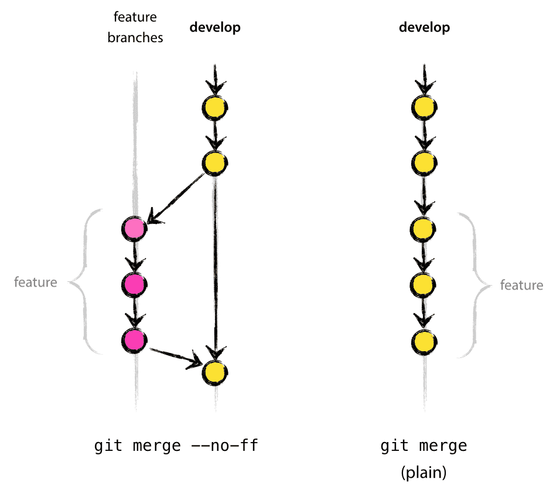

# Git style

## 1. 开发模型

通过git进行代码管理，其开发模型如下图所示，其分支管理策略与发布管理如下图所示。
<div style="text-align: center; width: 100%"></div>

### 1.1 主分支


主分支为中心分库中的长期还在分支：主要为

   * master
   * develop
  
这两个分支的开发模型如图所示。

#### master 分支

master分支的代码是处于可用于生产环境状态的代码, master环境为最高版本号的release代码

```
We consider origin/master to be the main branch where the source code of HEAD always reflects a production-ready state.
```

#### develop 分支

develop分支的代码处于最新开发结果状态，下次发布将从这里产生。也有称本分支为集成分支，持续集成就是从本分支上进行编译。

```
We consider origin/develop to be the main branch where the source code of HEAD always reflects a state with the latest delivered development changes for the next release. Some would call this the “integration branch”. This is where any automatic nightly builds are built from.
```

### 1.2 支持分支

在开发模型中，仅次于master与develop分的是一系列的支持分支。支持分支是为分便团队成员间的并行开发，产品功能跟踪，产品发布准备与产品bug的快速解决。支持分支一般具有暂短的生命周期，因为他们最后总是会初删除。

一般支持分支分为以下三类：

   * feature
   * release
   * hotfix

#### feature 分支


命名规范: 除了master, develop, release-*或hotfix-* 的任何其它名称

Feature分支用于开发新的功能, 它源自于develop分支, 最终将合并到develop分支.

<center>创建feature分支</center>
当开发新功能的开发时, 从**develop**分支创建一个feature分支：

``` sh
$ git checkout -b myfeature develop
Switched to a new branch "myfeature"
```

<center>合并已完成的feature分支</center>
当新功能开发完成后, 将feature分支合并到**develop**分支，并上传到远程仓库：

``` sh
$ git checkout develop
Switched to branch 'develop'
$ git merge --no-ff myfeature
Updating ea1b82a..05e9557
(Summary of changes)
$ git branch -d myfeature
Deleted branch myfeature (was 05e9557).
$ git push origin develop
```
**--no-ff** 参数是为了防止丢失特征分支的历史存在的信息
比较图如下所示
<div style="text-align: center; width: 100%"></div>


#### release 分支

命名规范: release-*

Release分支用于准备一个新的产品发布. 它允许在发布前进行bug的修复, 功能的修改以及测试等.

Release分支源于develop分支, 最终将被合并到master和develop分支. 只有当develop分支处于即将发布的状态时, 才创建release分支以进行发布前的准备. 只有当release分支到达可以发布的状态时, 才被合并到master用于发布, 并且合并回develop分支. 版本号(package.json, git tag)只有在release分支才被创建并且增加.
<center>创建release分支</center>
当准备发布产品时, 从**develop**分支创建一个release分支,进入产品发布测阶段，此阶段只修改bug不新增功能：
假如当前需要发布1.2.0版本

``` sh
$ git checkout -b release-1.2.0 develop
Switched to a new branch "release-1.2.0"
$ git push -u origin release-1.2.0
```

<center>完成release分支</center>
当发布测试通过后，完成产品的发布：
./bump-version.sh 表示修改产品的版本号

``` sh
$ git checkout master
Switched to branch 'master'
$ git merge --no-ff release-1.2.0
Merge made by recursive.
(Summary of changes)
$ git tag -a 1.2.0

$ git checkout develop
Switched to branch 'develop'
$ git merge --no-ff release-1.2.0
Merge made by recursive.
(Summary of changes)

$ git branch -d release-1.2.0
Deleted branch release-1.2.0 (was ff452fe).

$ ./bump-version.sh 1.2.1
Files modified successfully, version bumped to 1.2.1.
$ git commit -a -m "Bumped version number to 1.2.1"
[develop 74d9424] Bumped version number to 1.2.1
1 files changed, 1 insertions(+), 1 deletions(-)
$ git push origin develop
```

#### Hotfix 分支

命名规范: hotfix-*

当生产环境出现急需解决的问题时, Hotfix分支才被创建. 它源于master分支, 最后将被合并到master和develop分支.

<center>创建hotfix分支</center>
假如当前已发布版本为1.2.0

``` sh
$ git checkout -b hotfix-1.2.1 master
Switched to a new branch "hotfix-1.2.1"
$ ./bump-version.sh 1.2.1
Files modified successfully, version bumped to 1.2.1.
$ git commit -a -m "Bumped version number to 1.2.1"
[hotfix-1.2.1 41e61bb] Bumped version number to 1.2.1
1 files changed, 1 insertions(+), 1 deletions(-)
```

<center>完成hotfix分支</center>

``` sh
$ git checkout master
Switched to branch 'master'
$ git merge --no-ff hotfix-1.2.1
Merge made by recursive.
(Summary of changes)
$ git tag -a 1.2.1

$ git checkout develop
Switched to branch 'develop'
$ git merge --no-ff hotfix-1.2.1
需要手动合并版本号冲突问题

$ git branch -d hotfix-1.2.1
Deleted branch hotfix-1.2.1 (was abbe5d6).

$ ./bump-version.sh 1.2.2
Files modified successfully, version bumped to 1.2.2.
$ git commit -a -m "Bumped version number to 1.2.2"
[develop 74d9424] Bumped version number to 1.2.2
1 files changed, 1 insertions(+), 1 deletions(-)
$ git push origin develop
```

## 2. 提交记录规范(Commit Message)

从目前公司gitlab上查看到的提交已记录信息比较乱，且有许多无效信息。在本文中对commit message的进行规范。
格式参考 [AngularJS’s commit message convention](https://github.com/angular/angular.js/blob/f3377da6a748007c11fde090890ee58fae4cefa5/CONTRIBUTING.md#commit), AngularJS 制定这样的约定是出于几个目的

* 自动生成 CHANGELOG.md
* 识别不重要的提交
* 为浏览提交历史时提供更好的信息

后面简称 AngularJS’s commit message convention 为 conventional message。

### 2.1 格式
**conventional message** 的格式为

```
<type>(<scope>): <subject>
<BLANK LINE>
<body>
<BLANK LINE>
<footer>
```

`scope` 用于说明 commit 影响的范围，比如数据层、控制层、视图层等等，视项目不同而不同。

`subject` 是 commit 目的的简短描述，不超过50个字符。

* 以动词开头，使用第一人称现在时，比如change，而不是changed或changes

* 第一个字母小写

* 结尾不加句号（.）

`body` 是更为详细的描述。

`type` 则定义了此次变更的类型，只能使用下面几种类型

* feat：增加新功能
* fix：问题修复
* docs：文档变更
* style：代码风格变更（不影响功能）
* refactor：既不是新功能也不是问题修复的代码变更
* perf：改善性能
* test：增加测试
* chore：开发工具（构建，脚手架工具等）

`footer` 可以包含 Breaking Changes 和 Closes 信息。

### 2.2 可用工具

目前格式工具是以node编写，在使用工具前要先初始化node环境。

* 安装node自己下载安装
* 配置node

``` sh
$ npm install -g nrm --registry=https://registry.npm.taobao.org 
$ nrm use taobao
```

#### Commitizen

命令行工具[commitizen](https://github.com/commitizen/cz-cli)帮助开发者生成符合 conventional message 的提交记录。

全局安装**commitizen**工具

``` sh
$ npm install -g commitizen
```
全局安装**commitizen**的适合器

``` sh
$ npm install -g cz-conventional-changelog
```
配置： mac/linux
``` sh
$ echo '{"path": "cz-conventional-changelog"}' > ~/.czrc
```
配置：windows

* 打开cmd, 切换到home文件夹下。一般打开cmd就在home目录下
  
``` sh
$ echo {"path": "cz-conventional-changelog"} > .czrc
```

#### conventional-changelog

命令行工具[conventional-changelog](https://github.com/conventional-changelog/conventional-changelog)用于生成changelog

全局安装**conventional-changelog**工具

``` sh
$ npm install -g conventional-changelog-cli
```

自动生成changelog

``` sh
$ conventional-changelog -p angular -i CHANGELOG.md -s
```